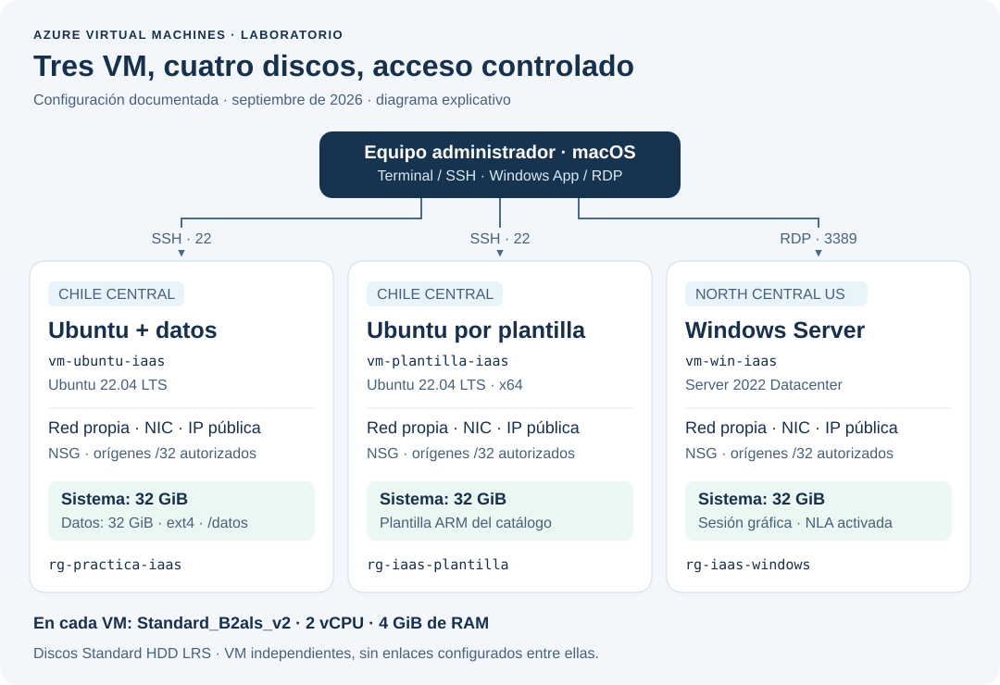
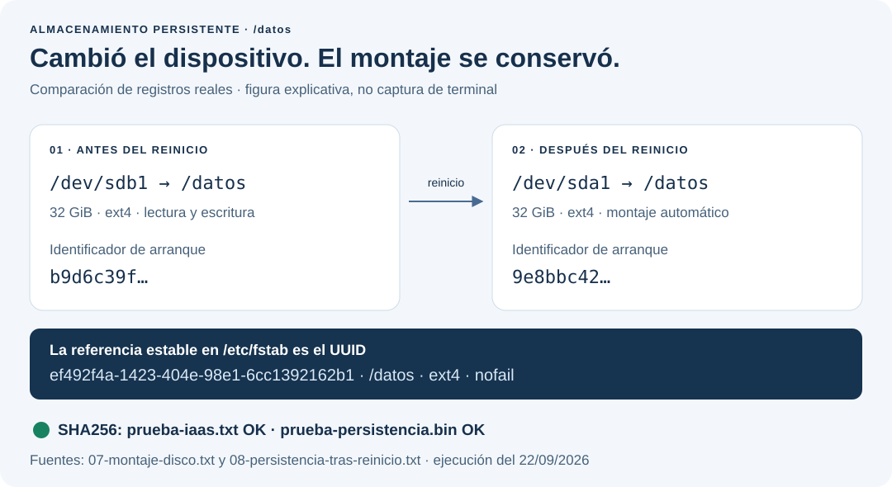
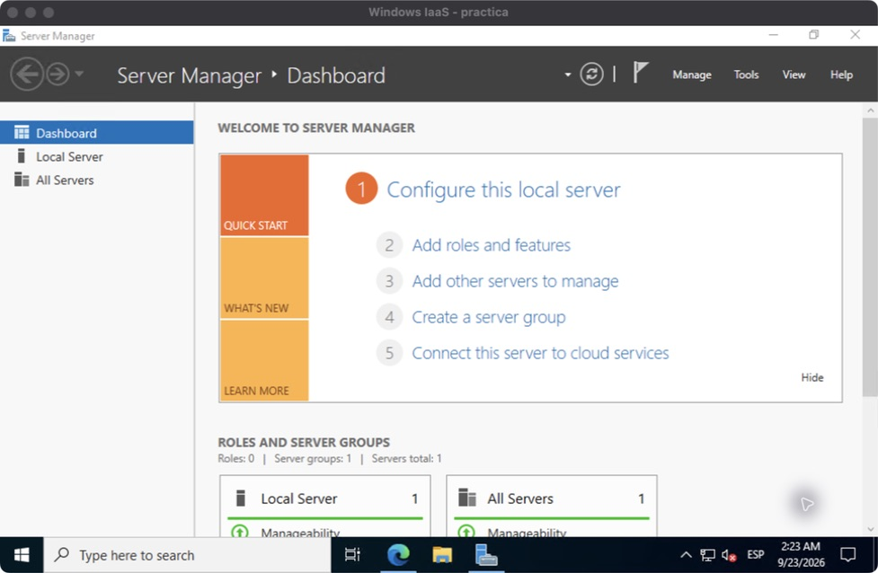

# Azure Virtual Machines · Práctica IaaS

**Ubuntu, almacenamiento persistente, infraestructura como código y Windows con escritorio remoto.**

Práctica de Cloud Computing del profesor **Oscar H. Mondragón**, realizada con una suscripción **Azure for Students**. El objetivo es comprender qué proporciona Azure y qué debe administrar el usuario al trabajar con infraestructura como servicio.

La implementación comprende **tres máquinas virtuales, cuatro discos administrados y tres grupos de recursos**. Este repositorio reúne configuración, automatización, decisiones técnicas y evidencias de las pruebas realizadas. No contiene claves privadas ni credenciales de acceso.



*Diagrama explicativo de los recursos documentados; no es una captura del portal. Cada grupo tiene su propia red, interfaz, IP pública y grupo de seguridad. No se configuró comunicación entre las tres VM.*

## Resultados y evidencias

| Requisito del laboratorio | Implementación | Evidencia verificable |
|---|---|---|
| Crear una VM Ubuntu y acceder a ella | Ubuntu Server 22.04 LTS, x64, generación 2; acceso SSH con clave | [Conexión y sistema](evidencias/verificacion-2026-09-23/ubuntu-ssh.txt) · [Configuración de Azure](evidencias/02-configuracion-ubuntu.json) |
| Crear y montar un disco adicional | Disco administrado de 32 GiB, ext4 en `/datos`, montaje por UUID | [Preparación del disco](evidencias/07-montaje-disco.txt) · [Persistencia tras reinicio](evidencias/08-persistencia-tras-reinicio.txt) |
| Crear una VM desde un template del catálogo | Plantilla oficial conservada y adaptación desplegada como `vm-plantilla-iaas` | [Procedencia y cambios](Plantilla-del-catalogo.md) · [Despliegue `Succeeded`](evidencias/verificacion-2026-09-23/plantilla-despliegues.json) · [SSH](evidencias/verificacion-2026-09-23/plantilla-ssh.txt) |
| Desplegar Windows y conectarse mediante RDP | Windows Server 2022 Datacenter; Windows App para macOS | [Captura del escritorio](evidencias/capturas/windows-server-manager.jpg) · [Sesión remota autenticada](evidencias/verificacion-2026-09-23/windows-sesion.json) |
| Cerrar la ejecución conservando los datos | Tres VM desasignadas y cuatro discos conservados | [Estado al finalizar la validación](evidencias/verificacion-2026-09-23/estado-final.json) |

**Fecha de las pruebas:** 22 de septiembre de 2026 en Colombia; algunos registros están fechados el 23 de septiembre en UTC. Son resultados históricos, no un panel del estado actual de Azure. La revisión documental del repositorio no vuelve a ejecutar ni enciende las VM.

## Qué demuestra de IaaS

| Azure proporciona | El usuario configura y administra |
|---|---|
| Centros de datos, servidores físicos y virtualización | Imagen del sistema operativo, tamaño y región de la VM |
| Servicios de red y almacenamiento administrado | Redes virtuales, interfaces, reglas de acceso y discos elegidos |
| Plano de control y operaciones de los recursos | Usuarios, claves, acceso SSH/RDP y sistema de archivos del huésped |
| Capacidad para iniciar, detener y desasignar | Validación, respaldo y control del ciclo de vida |

Una VM encendida no implica que exista una sesión SSH o RDP. Un disco adjuntado en Azure tampoco implica que Linux ya lo tenga montado. La práctica comprueba estos pasos por separado.

## Configuración utilizada

| VM | Grupo de recursos | Región | Sistema | Tamaño | Discos |
|---|---|---|---|---|---|
| `vm-ubuntu-iaas` | `rg-practica-iaas` | `chilecentral` | Ubuntu 22.04 LTS | `Standard_B2als_v2` | Sistema 32 GiB + datos 32 GiB |
| `vm-plantilla-iaas` | `rg-iaas-plantilla` | `chilecentral` | Ubuntu 22.04 LTS | `Standard_B2als_v2` | Sistema 32 GiB |
| `vm-win-iaas` | `rg-iaas-windows` | `northcentralus` | Windows Server 2022 | `Standard_B2als_v2` | Sistema 32 GiB |

Cada VM utiliza **2 vCPU y 4 GiB de RAM nominales**. Los discos son **Standard HDD LRS**. En las consultas de Linux se observan aproximadamente 3.8 GiB utilizables. La configuración registrada incluye Trusted Launch, arranque seguro y TPM virtual.

El enunciado propone Central US y `Standard_DS1_v2`. Se documentó la adaptación a las regiones autorizadas y se eligió `Standard_B2als_v2`. El inventario conservado **también enumera DS1_v2 en Chile Central**: por tanto, no se atribuye el cambio de tamaño a una indisponibilidad demostrada. La elección y sus límites se explican en [decisiones técnicas](docs/decisiones-tecnicas.md).

## Un resultado relevante: el dispositivo cambió, los datos permanecieron



En el registro inicial, `/datos` estaba en `/dev/sdb1`; después del reinicio apareció en `/dev/sda1`. El montaje siguió funcionando porque `/etc/fstab` identifica el sistema de archivos mediante su **UUID**. Además, cambió el identificador de arranque y ambos archivos devolvieron `OK` al comprobar sus SHA256.

La figura resume [dos registros reales](docs/ubuntu-y-almacenamiento.md#prueba-de-persistencia); no es una captura de terminal. Un hash correcto acredita integridad respecto a las sumas guardadas; la evidencia del nuevo arranque es la que permite relacionarlo con la persistencia.

## Captura real de Windows



*Captura original conservada durante la validación del 23/09/2026 UTC. Se publica sin alteraciones: no muestra la IP pública ni contraseñas. La captura acredita el escritorio visible; la identidad de la VM y la sesión autenticada se contrastan con el [registro RDP](evidencias/verificacion-2026-09-23/windows-sesion.json) y el [sistema Windows](evidencias/verificacion-2026-09-23/windows-sistema.json). [Procedencia e integridad de la imagen](evidencias/capturas/README.md).*

## Recorrido de lectura

1. [Guía técnica](Guia-tecnica.md): preparación de Azure CLI, despliegue inicial, conexión y cierre.
2. [Ubuntu y almacenamiento](docs/ubuntu-y-almacenamiento.md): comandos, interpretación del montaje y prueba del reinicio.
3. [Plantilla del catálogo](Plantilla-del-catalogo.md): origen, parámetros, recursos y diferencias del JSON.
4. [Windows y RDP](Windows-y-RDP.md): sistema, red, escritorio y validación de la sesión.
5. [Decisiones técnicas](docs/decisiones-tecnicas.md): regiones, tamaño, seguridad, costos y limitaciones.
6. [Resultados y trazabilidad](docs/resultados.md): qué prueba cada registro y qué no permite concluir.

## Comprobar las evidencias sin una cuenta Azure

```bash
git clone https://github.com/nathernandez1189/practica-iaas-azure.git
cd practica-iaas-azure
python3 scripts/verificar_evidencias.py
```

Este verificador usa únicamente Python 3 y los archivos del repositorio. Comprueba JSON, hashes de las plantillas y la captura, evidencias del reinicio, sesión RDP, estado final registrado y enlaces locales de la documentación. **No se conecta a Azure ni comprueba su estado actual.**

Para operar recursos se necesita una suscripción explícita y los archivos de acceso privados; consultar la [guía técnica](Guia-tecnica.md). Los resultados nuevos se guardan en `resultados-locales/`, excluida de Git, para revisarlos antes de publicar.

## Alcance y límites

- Las pruebas documentan una implementación funcional de los cuatro componentes técnicos del enunciado. Se utilizó Azure CLI y ARM para automatizarla; no se afirma haber reproducido cada pantalla del video del curso.
- Las VM son independientes. No se implementaron balanceo, alta disponibilidad ni una aplicación distribuida entre ellas.
- La conectividad depende de la IP de origen autorizada, la disponibilidad regional, la cuota y el estado de las VM.
- Las capturas y registros muestran ejecuciones fechadas. No garantizan acceso permanente a los recursos.
- Desasignar libera cómputo; los discos y recursos de red conservados pueden seguir generando cargos. [Estados y facturación de Azure](https://learn.microsoft.com/en-us/azure/virtual-machines/states-billing).

## Referencias

- [Enunciado del laboratorio](referencias/2025-03%20Practica%20IaaS.pdf) y [guía de regiones](referencias/guia-regiones-azure.pdf), material del curso.
- [Tutorial Ubuntu indicado en el enunciado](https://youtu.be/cnstIJVRlYg).
- [Tutorial Windows indicado en el enunciado](https://www.youtube.com/watch?v=iUaTq06m26g).
- [Microsoft Learn: adjuntar un disco a Linux](https://learn.microsoft.com/en-us/azure/virtual-machines/linux/attach-disk-portal).
- [Catálogo: Deploy a simple Ubuntu Linux VM](https://learn.microsoft.com/en-us/samples/azure/azure-quickstart-templates/vm-simple-linux/).
- [Microsoft Learn: conexión RDP a Windows](https://learn.microsoft.com/en-us/azure/virtual-machines/windows/connect-rdp).

La plantilla de Microsoft conserva su [licencia original](plantillas/LICENSE.catalogo.txt). Los identificadores ocultos en las evidencias son marcadores, no credenciales utilizables; ver [criterios de publicación](evidencias/README.md).
